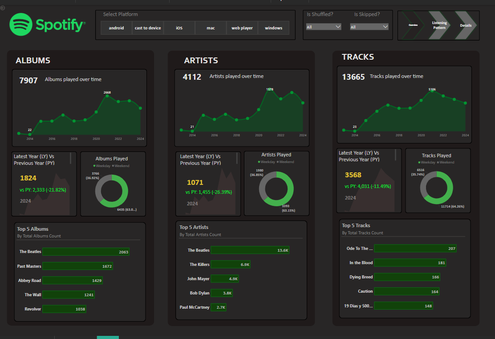
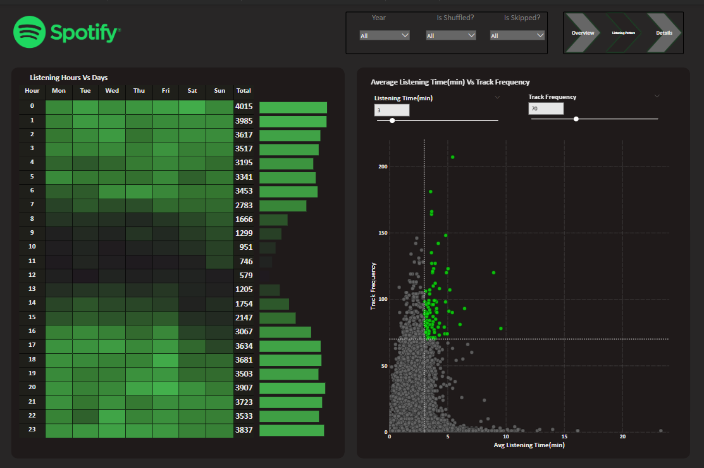
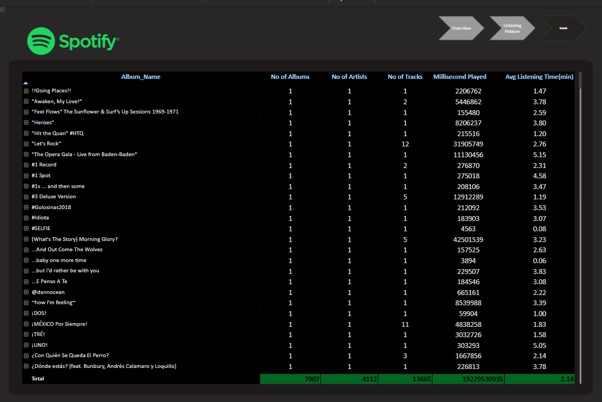

# 🎧 Spotify Listening Pattern Analysis – Power BI Project

### 📸 Dashboard Previews

**Overview Dashboard**  

**Listening Pattern Dashboard**  

**Details Dashboard**  

This Power BI project explores Spotify user data to uncover listening behavior, album and artist engagement, and track preferences. It delivers a multi-layered dashboard experience that highlights how, when, and what users listen to — providing valuable input for music analysts, marketers, and playlist curators.

---

## 🧩 Problem Statement

The goal of this project is to analyze a user's Spotify listening history to answer:

- Which albums, artists, and tracks are played most?
- At what time of day and on which days does listening peak?
- What is the average listening time per album or track?
- Are certain tracks skipped or shuffled more often?
- What is the relationship between track frequency and listening time?
- How do listening behaviors change year over year?

---

## 📌 KPIs Tracked

- **Total Albums, Artists, and Tracks**
- **Total Milliseconds Played**
- **Average Listening Time (per track and album)**
- **Top Listening Hours and Days**
- **Track Frequency vs. Listening Time**
- **Most Played Albums / Artists / Tracks**
- **Listening Trend (Yearly & Platform-Wise)**
- **Skip and Shuffle Behavior**

---

## 📊 Visualizations

| Visualization                              | Type              | Purpose                                                                 |
|-------------------------------------------|-------------------|-------------------------------------------------------------------------|
| Albums / Artists / Tracks Overview         | Line + KPI Cards  | Tracks growth and behavior across years                                |
| Listening Hours vs Days                    | Heatmap           | Reveals the most active listening periods                              |
| Avg Listening Time vs Track Frequency      | Scatter Plot      | Highlights engagement across long vs frequent tracks                   |
| Top 5 Albums / Artists / Tracks            | Bar Chart         | Highlights highest engagement content                                  |
| Year vs Previous Year Comparison           | Area Chart + KPIs | Tracks behavior trends and YOY performance                             |
| Platform, Shuffle, Skip Filters            | Slicers           | Enables behavioral segmentation                                        |
| Drill-through to Album/Track Details       | Navigation        | Allows focused exploration on specific albums or tracks                |
| Navigation Buttons                         | Page Navigation   | Smooth flow across Overview → Listening Pattern → Details              |

---

## 🔧 Tools & Techniques Used

- **Power BI Desktop**
- **Power Query Editor** for:
  - Cleaning and transforming multi-sheet Spotify data
  - Standardizing columns using reusable Power Query functions
- **DAX Measures & Calculated Columns**:
  - Listening time per track
  - Frequency thresholds
  - YOY change logic
  - Skip/Shuffle filter logic

---

## 💡 Features Implemented

- ✅ Drill-through from summary views to album/track-level detail
- ✅ YOY (Year-over-Year) comparison with dynamic variance indicators
- ✅ Device/platform usage tracking (Android, iOS, Web Player, etc.)
- ✅ Behavior segmentation via shuffle/skip slicers
- ✅ Interactive dashboards with smooth UI and dark-mode design

---

## 📁 Files Included

- `Spotify_Analysis.pbix` – Full Power BI Dashboard
- `Overview_Dashboard.png` – Albums/Artists/Tracks Trends
- `Listening_pattern_Dashboard.png` – Listening Time & Frequency
- `Details_Dashboard.png` – Album/Track Summary

---

## 🧠 Key Insights

- Peak listening hours are between **12 AM–6 AM** and **4 PM–10 PM**
- Some tracks were played **over 200 times**, with avg listening time > 3 minutes
- **The Beatles** lead as most listened-to artist (13.6K total track plays)
- YOY artist engagement decreased in 2024, while track plays slightly increased
- Listening was **more frequent on weekends**
- The use of shuffle/skipping varies across device platforms and track types

---

## 🚀 Future Enhancements

- Integrate **Spotify Web API** for live streaming data
- Add **emotion-based tagging** based on genre or lyrics
- Create a **track mood map** using sentiment analysis
- Build a **personal recommendation engine** based on listening patterns

---

